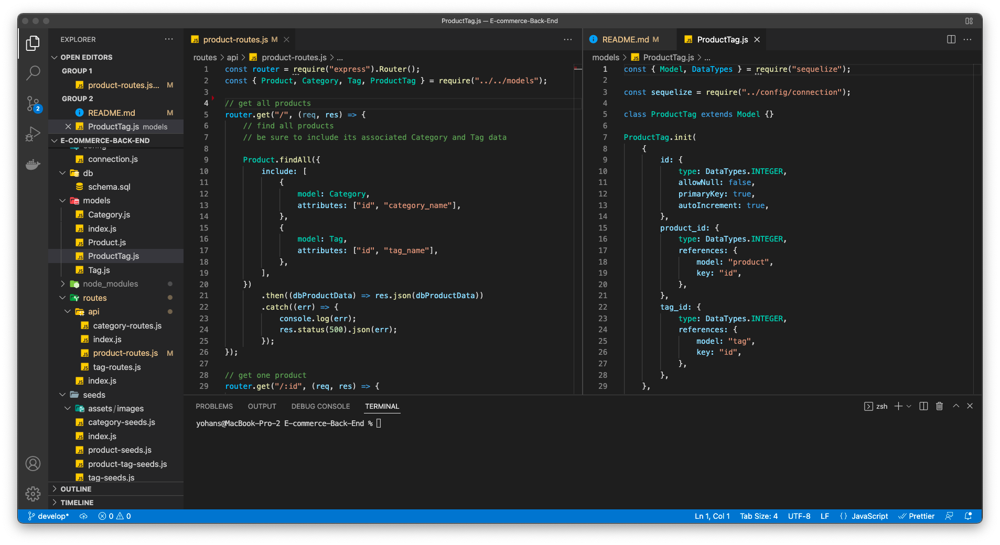

# E-commerce-Back-End

## Description

This is a back end for e-commerce site built with Express.js API and configure to use Sequelize with mysql2 dialect to interact with a MySQL database  

## Table of Contents

- [Installation](#installation)
- [Usage](#usage)
- [Snapshot](#snapshot)
- [License](#license)
- [Tests](#tests)
- [License](#license)
- [Questions](#questions)

## Installation

Instructions for Installation:
this a public repo that can be clon to local machine by following the gitHub link, and install Node.js to your machine then from your command line install npm and the following npm dependancies
{
    "dotenv": "^8.6.0",
    "express": "^4.17.3",
    "mysql2": "^2.3.3",
    "sequelize": "^5.22.5"
}

## Usage

after installation foutes can be tested and put to use with insomnia.

## Snapshot

The first video shows GET routes to return all categories, all products, and all tags being tested in Insomnia:

[Video]()

The second video shows GET routes to return a single category, a single product, and a single tag being tested in Insomnia:

[Video]()

The final animation video the POST, PUT, and DELETE routes for categories being tested in Insomnia:

[Video]()

## License

The project is licensed under MIT.

[More Info](https://choosealicense.com/licenses/)

## Contributing

If you like to contribut for this project please follow The Contributor Convenant guidelines.

## Tests

## Questions

Please don't hesitate to reach out to us if you have any questions.

Yohans Getaneh

GitHub: https://github.com/yohans14/E-commerce-Back-End

Email: yohans14@yahoo.com
